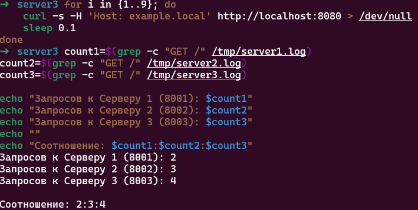

# Домашнее задание к занятию "`Кластеризация и балансировка нагрузки`" - `Белолипецкий Леонид`

---

### Задание 1

```bash
global
    log /dev/log    local0
    log /dev/log    local1 notice
    chroot /var/lib/haproxy
    stats socket /run/haproxy/admin.sock mode 660 level admin
    stats timeout 30s
    user haproxy
    group haproxy

defaults
    log     global
    mode    tcp
    option  tcplog
    option  dontlognull
    timeout connect 5000
    timeout client  50000
    timeout server  50000

listen web_tcp
    bind :8080
    mode tcp
    balance roundrobin
    server s1 127.0.0.1:8888 check
    server s2 127.0.0.1:9999 check

listen stats
    bind :9000
    mode http
    stats enable
    stats uri /stats
    stats refresh 5s
```


---

### Задание 2

```
global
    log /dev/log    local0
    log /dev/log    local1 notice
    chroot /var/lib/haproxy
    stats socket /run/haproxy/admin.sock mode 660 level admin
    stats timeout 30s
    user haproxy
    group haproxy

defaults
    log     global
    mode    http
    option  httplog
    option  dontlognull
    timeout connect 5000
    timeout client  50000
    timeout server  50000

frontend http_front
    bind :8080
    mode http
    
    acl is_example_local hdr(host) -i example.local
    
    use_backend web_servers if is_example_local
    
    default_backend no_match

# Backend для weighted round robin
backend web_servers
    mode http
    balance roundrobin
    option httpchk
    
    # Серверы с весами: 2, 3, 4
    server s1 127.0.0.1:8001 weight 2 check
    server s2 127.0.0.1:8002 weight 3 check
    server s3 127.0.0.1:8003 weight 4 check

backend no_match
    mode http
    errorfile 503 /etc/haproxy/errors/503.http

listen stats
    bind :9000
    mode http
    stats enable
    stats uri /stats
    stats refresh 5s
```




