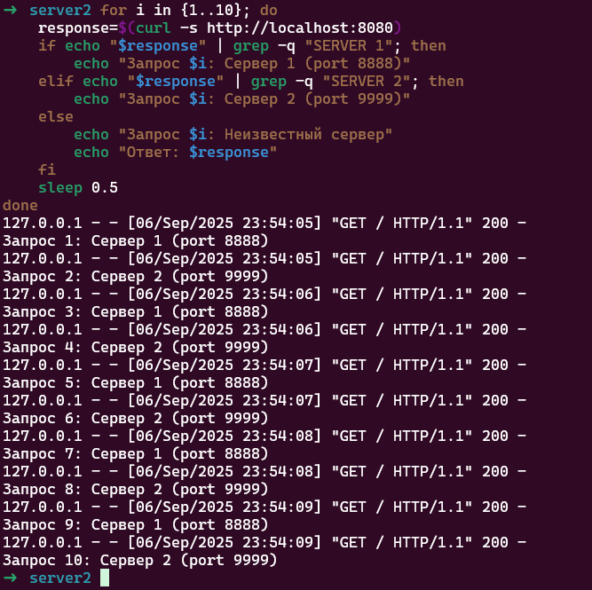

# Домашнее задание к занятию "`Кластеризация и балансировка нагрузки`" - `Белолипецкий Леонид`

---

### Задание 1

Конфигурационный файл HAProxy1 [здесь](HAProxy/haproxy1.cfg)

Здесь на фото показано, перенаправление на 2 порта

---

### Задание 2

Конфигурационный файл HAProxy2 [здесь](HAProxy/haproxy2.cfg)

Балансировка работает с доменом example.local

с любым доменом, кроме example.local

